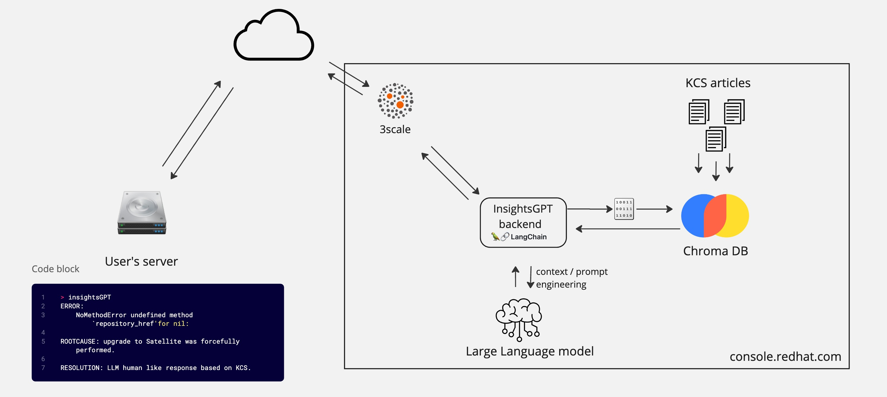

# insightsGPT

Application for scanning RHEL systems (also insights-report/sosreports), diagnosing and triaging issues in simple english. With the help of Red Hat’s knowledge base(KCS)  + the power of LLM(Large language model) pulls out the relevant information and provides resolution.

Service can integrate with pre existing tools like insights-client, sos(sosreport) etc.


## Architecture Diagram





## Installation

We use poetry for dependency management so make sure that poetry binary is installed - [doc](https://python-poetry.org/docs/).

```bash
curl -sSL https://install.python-poetry.org | python3 -
```

Install the needed dependencies. 

```bash
poetry install
```

Start llm service using below. 
```
make run-llm 
```
## Usage

llm service has a `/completions` endpoint where one can pass the context and ask the related question to llm model.  

```
curl -X POST -H "Content-Type: application/json" http://127.0.0.1:8080/v1/chat/completions -d '{"context": "Hi, My date of birth is 5th Jan", "question":"When is my birthday?"}' | jq
```
